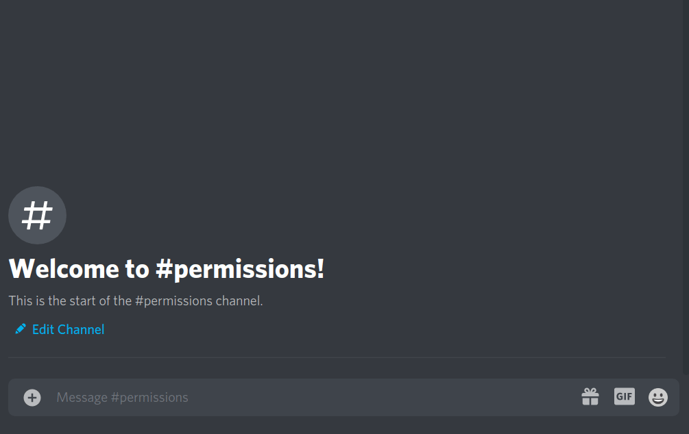
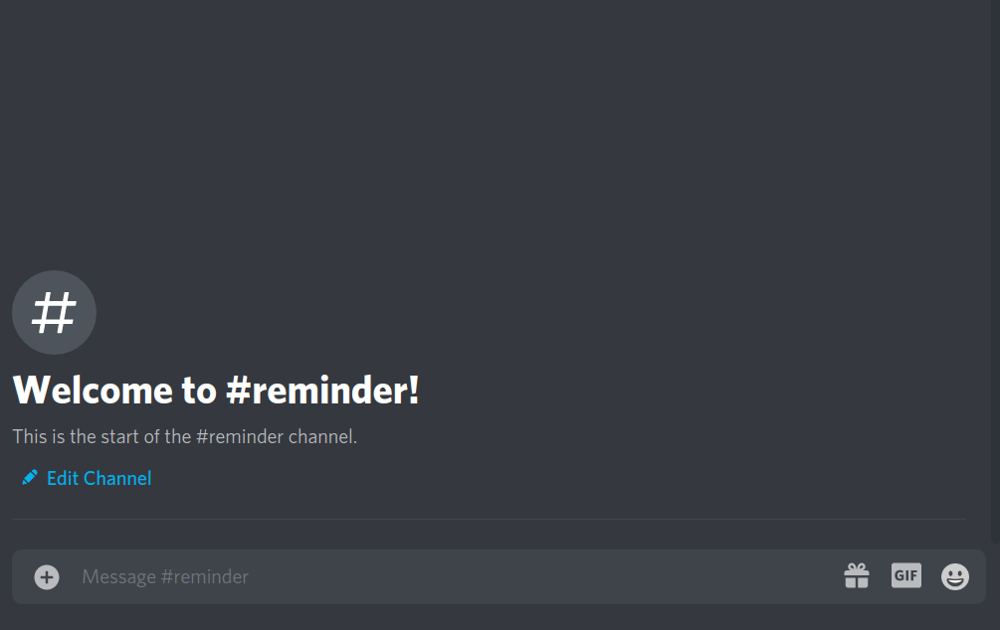

<h1 align="center"> TODO Bot for  Discord  
<a href="http://invite.todo-bot.xyz">
    
</a>
</h1>


<h4 align="center">


<a href="https://discord.gg/RuEdX5T">

</a>


</h4>

<h3 align="center">


</h3>


<br>


# 📝 About the Bot

This Bot aims to provide a virtual TODO list inside your discord server. Instead of relying on commands for interacting with the bot, I tried my best to make the entire "user interface" with reactions. That way your users dont have to learn hundrets of new commands and how to use them.

<br>


# 🎬 Getting Started

After inviting the Bot to your server, run the command `/settings set todochannel: #yourchannel`. This generates a new config and saves your todochannel. Your TODOS or tasks will then be posted in that channel.


# 🖥️ Commands

To view all the commands the bot supports, run the `/help` command. If you want to get more specific information about a command run the command `/help` with the command that you want information about as frist argument. So if you wanted to get information about the todo command, you would want to run the command like so: `/help todo`.


**Available Commands:**

<!--STARTCMDSECTION-->

 - [assign](./docs/assign "Assign someone to a task no matter if they want or not.") 
 - [blacklist](./docs/blacklist "Blacklist user(s) and/or channel(s)") 
 - [help](./docs/help "Show all available commands and their usage.") 
 - [invite](./docs/invite "Invite the bot to your server.") 
 - [list](./docs/list "List todos for your server. Use the 🔄 emoji to repot the currently open todo. Use the arrow emojis to navigate.") 
 - [reminder](./docs/reminder "Create, edit and view reminders") 
 - [settings](./docs/settings "View and edit bot settings.") 
 - [shorten](./docs/shorten "Shorten a link.") 
 - [stats](./docs/stats "Show some bot statistics like memory or CPU Usage.") 
 - [suggest](./docs/suggest "Suggest new features to be added into the bot") 
 - [support](./docs/support "Get information on how to contact the developer(s).") 
 - [tag](./docs/tag "Bild your own commands like a pro.") 
 - [todo](./docs/todo "Create a new TODO object") 
 - [tutorial](./docs/tutorial "Get a short tutorial on how to use the bot.") 
 - [var](./docs/var "Set, view, edit and delete configvariables. Use them in your tags like so: <%foo%> to be replaced with the variable 'foo'") 
 - [vote](./docs/vote "If you like the bot vote for it!") 


<!--ENDCMDSECTION-->


<br>

# 🔐 Permissions

There are 2 permission levels: `USER` and `STAFF`. They are determined by roles. 

To set the role, use the settings command like so:

(yes multiple roles are allowed)



To remove a role from the user of staffroles array just use the `/settings remove userrole: | staffrole:` command

<br>


# ⌨️ Custom Commands / Tags

Tags are a way to essentially build your own custom commands. Let the bot learn new tags by using the `/tag learn` command like so:


Delete a custom command by using the `/tag unlearn` command followed by the name of your tag.


<br>

## **Placeholders**

Placeholders are words that you can place inside your tags, that will be replaced with a certain value, when the custom command is run. 

Available Placeholders:

```diff
+ <MEMCOUNT> => Will be rpelaced with the membercount of the current guild
+ <JOIN_POS> => Will be replaced by the join position of the message author
+ <EMBED> => Will generate an embed with your tag message. Optional Parameters are <COLOR> BLUE </COLOR>, (make sure to include a space after the color tags)  img.todo-bot.xyz/bliDnJn </IMG>, <THUMB> img.todo-bot.xyz/bZLhbHl </THUMB>
+ <PROCESSED> => Will be replaced with the amount of processed tasks by the message author
+ <SUBMITTED> => Will be replaced with the amount of submitted tasks by the message author
+ <MSG_AUTHOR> => Will tag the message author
+ <MSG_AUTHOR_ID> => Will be replaced with the message author id
+ <MSG_AUTHOR_NAME> => Will be replaced with the message authors username, so in my case "MeerBiene"
+ <MSG_AUTHOR_TAG> => Will be replaced with the message authors tag, so in my case "MeerBiene#7060"
+ <GUILD_NAME> => Will be replaced with the guilds name where the message was sent
```

**Notes:** 
- All placeholders are ignorecase, so you can use them like `<join_pos>` or `<guild_name>`

- You can combine all the placeholders, so you can use the `<guild_name>` placeholder within an embed

<br>

## **Variables**

Variables are a way to store key-value pairs for your guild/server, so you can use them in your tags. This is useful if you have a discord for lets say a game server where the ip could change. To follow our example, we would create a variable called `ip` and store the ip adress:


<br>

# 🔔 Reminders



Note: 

- **The lowest possible time is 1m (1 Minute)!**


## **Mentions**

If you want to mention certain users or roles when the reminder finished, just mention them in the reminders content when creating a new reminder.

## **Repeating reminders**

For repeating reminders, simply set the `loop` property to true when creating the reminder. **Keep in mind that the lowest possible time for repeating reminders is 1 hour!**

<br>

# 😇 Support the developer(s)

I do this project in my freetime and I host the bot for free. If you like the Bot and it is helpful to you, consider sponsoring me here on github. Your profile or organization will then be placed below.

**Sponsors(0)**:


<br>

# 👥 Contributing:

All contributions are welcome! Wheter its just submitting bugs and/or requesting features, or contributing to the codebase directly via pull requests. 

For information on the development setup, check out the [contributing guidelines](/.github/CONTRIBUTING.md).

All Contributors will be listed below:

- Julian Puffler  [Github](https://github.com/puf17640) | *Code Contributor*
- Husky [Github](https://github.com/Huskydog9988) | *Code Contributor, Feedback giver*


**If you are reading this, I still need help with localization(language support), if you want to help, join the [Support Discord](https://discord.gg/RuEdX5T) and ping me.**

<br>


<h1>
<a href="https://discord.gg/RuEdX5T">

Support Discord
💬
</a>
</h1>


Whether you need help with the bot, want to try the bot and see it in action, want to suggest new features, or just want to flame me for my bad code, join the support server with the button above.

You can also use Github Issues if you dont want to join the discord.


Theres also a `/suggest` command for sending suggestions to the support server where ppl can up or downvote them.

I also do regular votes on new features in there, so if you want to have a say in the features that will be implemented, you know what to do.
